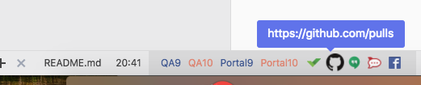

# Pin URLs to Atom Status Bar
Pin useful URLs to your atom status bar.

Based of Pedro J. Parra Cantero's idea: [Atom Hyperlinks](https://github.com/pedroparra/atom-hyperlinks).

## Installing
Clone the repo. Then do a `apm link` to add package to atom.

*OR*

`apm install pin-url`

*OR*

go to the atom package settings and find `pin-url`

## Settings
Go to package manage view to edit configurations.

## Next steps

### v0.6.0
- Add easy configurations.
  - wrap each url with label and color into object;
  - allow put less colors for alignment;
